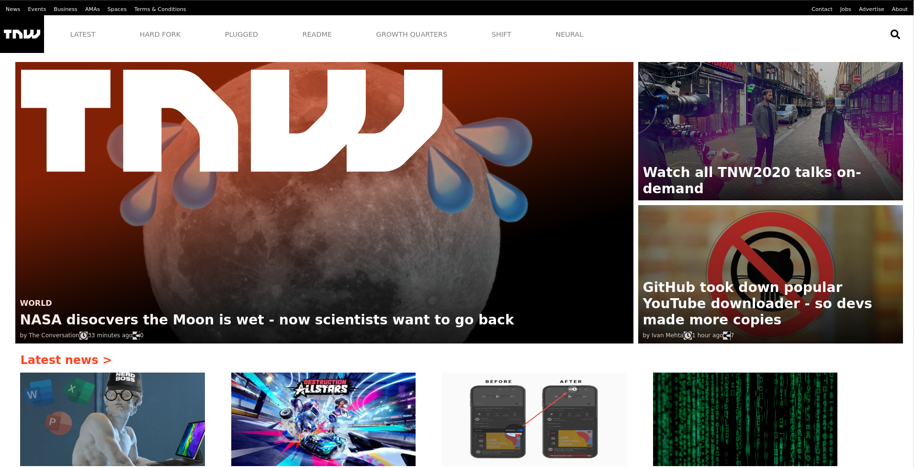

# The Next Web Clone

> This is a clone of thenextweb.com built with HTML & CSS with a mobile first approach.

Fully responsive clone 
[Original website](https://thenextweb.com/)

## Built With

- HTML
- CSS

## Live Demo

[Live Demo Link](https://iam-akshat.github.io/micr-project-2/src/index.html)

## Authors

👤 **Akshat Sethi**

- GitHub: [@iam-Akshat](https://github.com/githubhandle)
- Twitter: [@akshatsethi](https://twitter.com/akshatsethi)
- LinkedIn: [LinkedIn](https://www.linkedin.com/in/akshat-sethi-786737ba/)

👤 **Nihal Mohammad**

- GitHub: [@apricot12](https://github.com/apricot12)
- LinkedIn: [LinkedIn](https://www.linkedin.com/in/nihal-mohammed-1119391b2/)

## 🤝 Contributing

Contributions, issues, and feature requests are welcome!

Feel free to check the [issues page](issues/).

## Show your support

Give a ⭐️ if you like this project!

## Acknowledgments

- Google

## 📝 License

This project is [MIT](lic.url) licensed.
